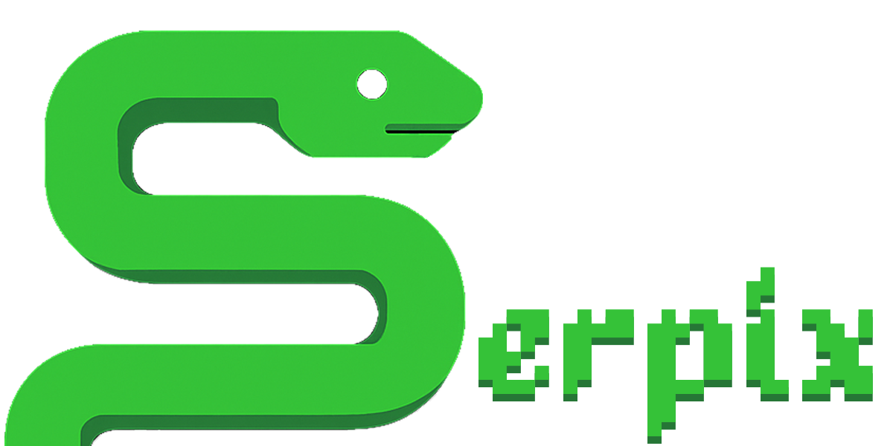

<h1>A Snake, Pong & Slither.io Hybrid Game</h1>

    Serpix is a fast-paced, two-player arcade game created by Pedro Vilas Bôas. It combines the classic
    body-growing mechanics of Snake with the competitive, head-to-head action of Pong and the continuous
    movement of Slither.io. Developed purely with vanilla HTML, CSS, and JavaScript, Serpix is a lightweight,
    offline-first browser game designed for local multiplayer fun!

<h1>Where to Play</h1>

    You can play the game directly on <a href="https://pedrovillasboas.github.io/SerpixGame/" target="_blank">Serpix</a>.

<h1>Gameplay & Features</h1>

    The objective is simple: force your opponent to collide with your snake's ever-growing body.

<ul>
    <li><strong>Two-Player Local Co-op</strong>: Battle a friend on the same keyboard in a strategic duel of
        wits and reflexes.</li>
    <li><strong>Dynamic Growth</strong>: Capture the bouncing "ball" to increase your score and lengthen your
        snake, making you a larger and more dangerous obstacle.</li>
    <li><strong>Last Snake Standing</strong>: Each player starts with 3 lives. The first to reduce their
        opponent's lives to zero is declared the winner.</li>
    <li><strong>Continuous Movement</strong>: Unlike traditional grid-based Snake, players have full 360-degree
        control, allowing for smooth, fluid turns and advanced tactics.</li>
    <li><strong>Persistent Leaderboard</strong>: Victories are recorded in a local leaderboard that tracks the
        winner's score and the match duration, sorted by highest score first and then fastest time.</li>
    <li><strong>Visual Feedback</strong>: The game is enhanced with "juice" in the form of particle effects for
        key moments like eating the ball, taking damage, and winning the game.</li>
</ul>

<h1>How to Play</h1>

    The controls are simple, focusing on turning your snake left or right.

<h2>Player 1:</h2>
<ul>
    <li><strong>A Key</strong>: Turn Left</li>
    <li><strong>D Key</strong>: Turn Right</li>
</ul>
<h2>Player 2:</h2>
<ul>
    <li><strong>← (Left Arrow) Key</strong>: Turn Left</li>
    <li><strong>→ (Right Arrow) Key</strong>: Turn Right</li>
</ul>

<h1>Technical Overview</h1>

    This game was built from the ground up to adhere to strict technical specifications, emphasizing clean code,
    modularity, and zero external dependencies.

<ul>
    <li><strong>Tech Stack</strong>: 100% Vanilla HTML, CSS, and JavaScript.</li>
    <li><strong>Separation of Concerns</strong>: The codebase is strictly organized into separate files for HTML
        structure, CSS styling, and JavaScript logic.</li>
    <li><strong>Object-Oriented Design</strong>: The game's logic is powered by JavaScript classes, including
        <code>Player</code>, <code>Ball</code>, <code>Game</code>, <code>Particle</code>, and
        <code>ParticleSystem</code>, ensuring the code is modular and reusable.</li>
    <li><strong>Dynamic DOM Manipulation</strong>: The UI, including the event log and leaderboard, is
        dynamically generated and updated via JavaScript to reflect the current game state.</li>
    <li><strong>Performance</strong>: The particle system is designed to be efficient, managing the lifecycle of
        each particle to prevent memory leaks and maintain a smooth frame rate.</li>
</ul>

<h1>How to Run Locally</h1>

    You must run it from a local web server to avoid browser security errors (CORS).

<h3>1. Using Visual Studio Code (Recommended):</h3>
<ul>
    <li>Install the <strong>Live Server</strong> extension by Ritwick Dey.</li>
    <li>Right-click on the <code>index.html</code> file.</li>
    <li>Select "Open with Live Server".</li>
</ul>

<h3>2. Using Python:</h3>
<ul>
    <li>Open a terminal or command prompt in the project's root directory.</li>
    <li>Run the command for Python 3: <code>python -m http.server</code></li>
    <li>Open your web browser and navigate to <code>http://localhost:8000</code>.</li>
</ul>

# Made by
| [ Pedro Villas Boas](https://github.com/PedroVillasBoas) |
| :---: |
